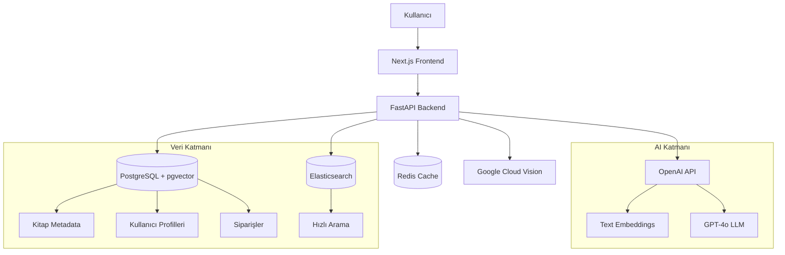
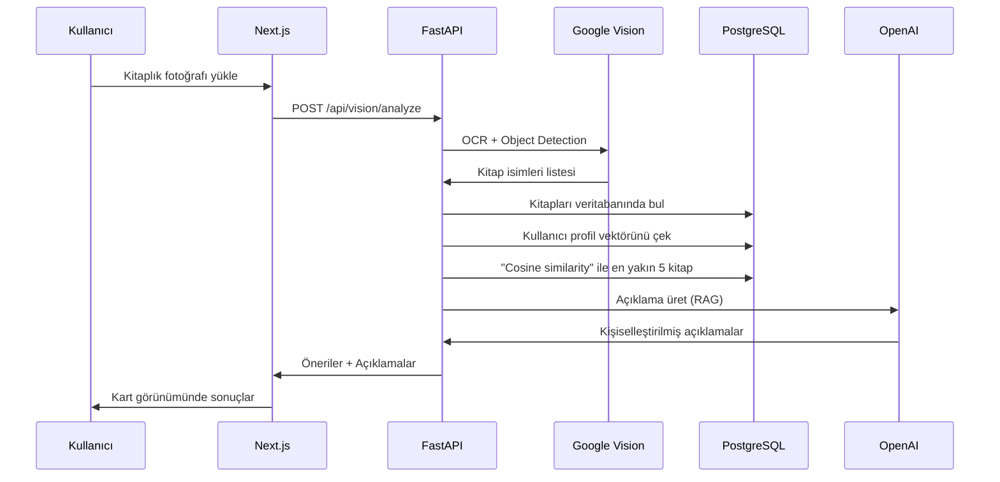

# BiblioMind - Detaylı Geliştirme Planı

## Sistem Mimarisi




## Veri Akış Şeması - Fotoğraftan Öneri




## Faz 1: Altyapı ve Temel Sistemler (0-4 Hafta)

### 1.1 Proje Kurulumu ve Yapılandırma

**Dizin Yapısı:**

```javascript
bibliomind/
├── backend/
│   ├── app/
│   │   ├── api/
│   │   │   ├── auth.py
│   │   │   ├── books.py
│   │   │   ├── vision.py
│   │   │   └── orders.py
│   │   ├── models/
│   │   ├── services/
│   │   ├── core/
│   │   └── main.py
│   ├── requirements.txt
│   └── Dockerfile
├── frontend/
│   ├── src/
│   │   ├── app/
│   │   ├── components/
│   │   ├── lib/
│   │   └── hooks/
│   ├── package.json
│   └── next.config.js
├── data/
│   └── scripts/
└── docker-compose.yml
```

**Gerekli Paketler:**

- Backend: `fastapi`, `uvicorn`, `sqlalchemy`, `psycopg2-binary`, `pgvector`, `elasticsearch`, `redis`, `openai`, `google-cloud-vision`, `langchain`, `pydantic`, `python-jose`, `passlib`, `bcrypt`
- Frontend: `next@14`, `react`, `typescript`, `tailwindcss`, `shadcn/ui`, `axios`, `react-query`, `zustand`

### 1.2 Veritabanı Şemaları

**PostgreSQL Tabloları:**

```sql
-- users: Kullanıcı bilgileri
CREATE TABLE users (
    id UUID PRIMARY KEY,
    email VARCHAR(255) UNIQUE NOT NULL,
    password_hash VARCHAR(255) NOT NULL,
    full_name VARCHAR(255),
    preferences_vector vector(1536),  -- OpenAI embedding boyutu
    created_at TIMESTAMP DEFAULT NOW()
);

-- books: Kitap metadata
CREATE TABLE books (
    id UUID PRIMARY KEY,
    title VARCHAR(500) NOT NULL,
    author VARCHAR(255),
    isbn VARCHAR(13),
    description TEXT,
    embedding vector(1536),  -- Özet + metadata vektörü
    price DECIMAL(10, 2),
    stock INTEGER DEFAULT 0,
    cover_image_url TEXT,
    genres TEXT[],
    created_at TIMESTAMP DEFAULT NOW()
);

-- user_interactions: Kullanıcı etkileşimleri
CREATE TABLE user_interactions (
    id UUID PRIMARY KEY,
    user_id UUID REFERENCES users(id),
    book_id UUID REFERENCES books(id),
    interaction_type VARCHAR(50), -- 'view', 'like', 'cart', 'purchase'
    created_at TIMESTAMP DEFAULT NOW()
);

-- photo_scans: Fotoğraf tarama geçmişi
CREATE TABLE photo_scans (
    id UUID PRIMARY KEY,
    user_id UUID REFERENCES users(id),
    image_url TEXT,
    detected_books JSONB,  -- Google Vision sonuçları
    recommendations JSONB,  -- Önerilen kitaplar
    created_at TIMESTAMP DEFAULT NOW()
);

-- orders: Siparişler
CREATE TABLE orders (
    id UUID PRIMARY KEY,
    user_id UUID REFERENCES users(id),
    total_price DECIMAL(10, 2),
    status VARCHAR(50),
    created_at TIMESTAMP DEFAULT NOW()
);

-- order_items: Sipariş kalemleri
CREATE TABLE order_items (
    id UUID PRIMARY KEY,
    order_id UUID REFERENCES orders(id),
    book_id UUID REFERENCES books(id),
    quantity INTEGER,
    price DECIMAL(10, 2)
);

-- İndeks oluşturma (performans için kritik)
CREATE INDEX idx_books_embedding ON books USING ivfflat (embedding vector_cosine_ops);
CREATE INDEX idx_users_preferences ON users USING ivfflat (preferences_vector vector_cosine_ops);
```

**Elasticsearch Index:**

```json
{
  "mappings": {
    "properties": {
      "title": {"type": "text", "analyzer": "turkish"},
      "author": {"type": "text"},
      "description": {"type": "text", "analyzer": "turkish"},
      "genres": {"type": "keyword"},
      "isbn": {"type": "keyword"}
    }
  }
}
```


### 1.3 Backend Temel Yapısı

**Dosya: `backend/app/main.py`**

- FastAPI app oluşturma
- CORS middleware
- JWT authentication middleware
- Router'ları dahil etme

**Dosya: `backend/app/core/config.py`**

- Environment variables
- OpenAI API key
- Google Cloud credentials
- Database URLs

**Dosya: `backend/app/services/openai_service.py`**

- Embedding oluşturma fonksiyonu
- GPT-4o ile açıklama üretme
- Token yönetimi

### 1.4 Frontend Temel Yapısı

**Ana Sayfalar:**

- `/` - Ana sayfa (arama + kategoriler)
- `/auth/login` - Giriş
- `/auth/register` - Kayıt
- `/discover` - Fotoğraftan keşfet (CORE FEATURE)
- `/books/[id]` - Kitap detay
- `/cart` - Sepet
- `/orders` - Siparişlerim
- `/profile` - Profil ayarları

**Temel Componentler:**

- `BookCard` - Kitap kartı
- `PhotoUploader` - Fotoğraf yükleme UI
- `RecommendationCard` - Açıklamalı öneri kartı
- `NavBar`, `Footer`

## Faz 2: AI ve Görsel İşleme (4-8 Hafta)

### 2.1 Kitap Veri Seti Hazırlığı

**Veri Kaynakları:**

- Goodreads dataset (Kaggle)
- Open Library API
- Türk yayınevlerinden scraping (opsiyonel)

**İşlem Adımları:**

1. CSV'leri temizle ve normalize et
2. Her kitap için embedding oluştur:
   ```python
               text_to_embed = f"{title} by {author}. {description[:500]}"
               embedding = openai.Embedding.create(input=text_to_embed, model="text-embedding-3-large")
   ```


3. PostgreSQL ve Elasticsearch'e yükle
4. En az 10,000 kitap ile başla

**Dosya: `data/scripts/populate_books.py`**

### 2.2 Google Cloud Vision Entegrasyonu

**Dosya: `backend/app/services/vision_service.py`Temel Fonksiyonlar:**

```python
async def detect_books_from_image(image_bytes: bytes) -> List[str]:
    # 1. Text detection (OCR)
    # 2. Object detection (kitap sırtlarını segmentasyon)
    # 3. Rotate image (90°, 180°, 270°) ve tekrar OCR
    # 4. Confidence > 0.7 olanları filtrele
    # 5. Kitap isimlerini temizle ve döndür
```

**Optimizasyon:**

- Dikey yazılmış sırtlar için 4 yönde OCR
- Regex ile kitap ismi pattern matching
- Fuzzy matching ile veritabanında eşleştirme

### 2.3 Anlamsal Öneri Motoru

**Dosya: `backend/app/services/recommendation_service.py`RAG Pipeline:**

```python
async def recommend_from_photo(user_id: UUID, detected_books: List[str]) -> List[Recommendation]:
    # 1. Kullanıcı profil vektörünü al
    user_vector = await get_user_preference_vector(user_id)
    
    # 2. Fotoğraftaki kitapları veritabanında bul
    book_ids = await find_books_by_names(detected_books)
    
    # 3. Cosine similarity hesapla
    similarities = []
    for book_id in book_ids:
        book = await get_book(book_id)
        score = cosine_similarity(user_vector, book.embedding)
        similarities.append((book, score))
    
    # 4. Top 5'i seç
    top_books = sorted(similarities, key=lambda x: x[1], reverse=True)[:5]
    
    # 5. GPT-4o ile açıklama üret
    explanations = await generate_explanations(user_id, top_books)
    
    return explanations
```

**Kullanıcı Profil Vektörü Oluşturma:**

- İlk kayıtta: Seçtiği favori yazarlar + türler
- Dinamik güncelleme: Beğendiği/satın aldığı kitapların embeddings'lerinin ortalaması

### 2.4 API Endpointleri

**POST** `/api/vision/analyze`

- Input: `multipart/form-data` (image file)
- Process: Vision API → Book detection → Recommendations
- Output: `{detected_books: [...], recommendations: [{book, explanation, score}]}`

**GET** `/api/books/search?q=...`

- Elasticsearch fulltext search

**GET** `/api/books/{id}`

- Kitap detayları

**POST** `/api/recommendations/by-preferences`

- Kullanıcı tercihlerine göre öneri (fotoğraf olmadan)

## Faz 3: E-Ticaret ve Kullanıcı Deneyimi (8-12 Hafta)

### 3.1 E-Ticaret Fonksiyonları

**Sepet Yönetimi:**

- `POST /api/cart/add` - Sepete ekle
- `GET /api/cart` - Sepeti görüntüle
- `DELETE /api/cart/item/{id}` - Sepetten çıkar

**Sipariş İşlemleri:**

- `POST /api/orders/create` - Sipariş oluştur
- `GET /api/orders` - Siparişlerim
- `GET /api/orders/{id}` - Sipariş detayı

**Ödeme Entegrasyonu:**

- İyzico API entegrasyonu (Türkiye için)
- Stripe (alternatif)

### 3.2 Kullanıcı Profilleme ve Tercih Öğrenimi

**Dosya: `backend/app/services/user_profiling_service.py`İlk Profil Oluşturma:**

- Kayıt sonrası onboarding: "Sevdiğin 3 kitap/yazar seç"
- Seçilen kitapların embedding'lerinin ortalamasını al

**Dinamik Güncelleme:**

- Her etkileşimde (görüntüleme, beğeni, satın alma) profil vektörünü güncelle:
  ```javascript
          new_vector = 0.8 * old_vector + 0.2 * book_embedding
  ```


### 3.3 Frontend Geliştirmeleri

**Fotoğraf Yükleme UX:**

- Drag & drop interface
- Kamera ile anlık çekim (mobil)
- Loading animation (işlem 5-10 saniye sürebilir)
- Progress bar: "Fotoğraf işleniyor... Kitaplar tanınıyor... Öneriler hazırlanıyor..."

**Öneri Kartları:**

```tsx
<RecommendationCard
  book={book}
  explanation="Bu kitabı seçtim çünkü..."
  matchScore={0.87}
  onAddToCart={handleAddToCart}
/>
```

**Responsive Design:**

- Mobil-first yaklaşım
- PWA desteği (offline cache için)

### 3.4 Optimizasyonlar

**Caching:**

- Redis ile sık aranan kitapları cache'le
- User profile vector'ünü Redis'te sakla (DB yükünü azalt)

**Background Jobs:**

- Celery ile asenkron işler:
- Fotoğraf işleme
- Embedding oluşturma
- Email bildirimleri

**Rate Limiting:**

- Vision API: Günlük 1000 istek limiti
- OpenAI: Token limitleri

## Teknoloji Detayları

### OpenAI Kullanımı

**Embedding Model:** `text-embedding-3-large` (3072 boyut, ama 1536'ya indirgenebilir)**LLM:** `gpt-4o` (açıklama üretimi için)**Maliyet Optimizasyonu:**

- Embedding'leri bir kez oluştur, cache'le
- GPT-4o için token limitlerini optimize et (max 500 token output)

**Örnek Prompt:**

```javascript
Sen BiblioMind asistanısın. Kullanıcı profili:
{user_preferences}

Fotoğraftaki kitaplar arasından bu kitabı önerdik:
{book_info}

Kullanıcıya, bu kitabı NEDEN önerdiğimizi 2-3 cümlede, samimi ve kişisel bir dille açıkla.
```


### Google Cloud Vision Setup

1. GCP projesi oluştur
2. Vision API'yi etkinleştir
3. Service account oluştur ve JSON key indir
4. `GOOGLE_APPLICATION_CREDENTIALS` env variable'ı ayarla

## Deployment Stratejisi

**Docker Compose (Development):**

```yaml
services:
  backend:
    build: ./backend
    ports: ["8000:8000"]
  frontend:
    build: ./frontend
    ports: ["3000:3000"]
  postgres:
    image: pgvector/pgvector:pg16
  elasticsearch:
    image: elasticsearch:8.11.0
  redis:
    image: redis:7-alpine
```

**Production (Öneriler):**

- Backend: Railway / Render / AWS EC2
- Frontend: Vercel / Netlify
- Database: Supabase / Neon (managed PostgreSQL + pgvector)
- Redis: Upstash
- Elasticsearch: Elastic Cloud

## Başarı Metrikleri

1. **Görsel İşleme Doğruluğu:** Fotoğraftaki kitapların %70+ doğru tanınması
2. **Öneri Kalitesi:** Kullanıcıların önerilen kitapların %30+ sepete eklemesi
3. **Performans:** Fotoğraf analizi < 10 saniye
4. **Kullanıcı Memnuniyeti:** Açıklamaların doğallığı ve kişiselleştirilmesi

## Risk ve Çözümler

| Risk | Çözüm ||------|-------|| OCR dikey yazıları okuyamaz | 4 yönde döndürme + fuzzy matching || Vision API maliyeti yüksek | İlk 1000 istek/ay ücretsiz, sonra cache kullan || Embedding maliyeti | Batch processing, sadece yeni kitaplara uygula || Yavaş yanıt süresi | Redis cache + background jobs (Celery) || Türkçe kitap tanıma zorluğu | Elasticsearch Turkish analyzer + manuel dataset |

## Geliştirme Sırası

1. **Hafta 1-2:** Backend altyapısı + Database + JWT auth
2. **Hafta 3-4:** Frontend base + Auth UI + Kitap listeleme
3. **Hafta 5-6:** Google Vision entegrasyonu + OCR test